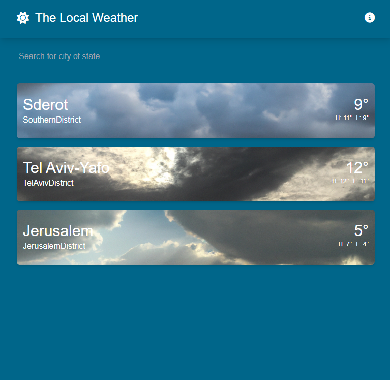

# Barbara-weather 🌪 

An app I wrote with react, in which you can send message and images to your friends and a groups, add them from application user list.
[Here is my project link](https://eldadyikne.github.io/Barbara-weather/ "Barbara-weather link")


## Whatspop Description
A small App that was built in a few days, I take that challenge to learn more of the use websocket like I want. 

### Technologies
- Axios 
- weather API 
- tailwind Css -ספרייה נוחה למפתחי פרונט css 
- Vue.Js (Transtions, router-view, Suspense and more) 


## Getting started
Clone the project or dowload the files on top.

```sh
git clone https://github.com/eldadYikne/Barbara-weather.git
```

Open the terminal and enter the following line to run it locally on your computer:

```sh
npm run dev
```

Runs the app in the development mode. Open http://127.0.0.1:5173/ to view it in the browser.


## Weather list 
You can view your different contacts, filter them by name. In addition, you can send message to contact.

 
 
 ## Weather CRUDL
You can CRUD your weather location any time.

 

 ## Some mobile!
Just a taste of the mobile experience. I used different conditional rendering, and the "mobile first" approach. 

